# Star Control II — Web Edition｜《星際控制 II》網頁版

這是《The Ur-Quan Masters HD Beta 1》的完整瀏覽器移植版，提供英文及繁體中文，
並保留完整戰役、超級對戰、語音、音樂、高解析度圖像及瀏覽器內存檔。繁中翻譯由
OpenAI Codex 語言模型完成，再經格式契約、字型生成、封裝測試與實機視覺檢查；
目前仍未經完整母語人工校訂及全流程通關。

> 本專案包含多種授權。程式碼主要採 GPL-2.0-or-later；遊戲文字、翻譯、圖像與音訊衍生內容採 CC BY-NC-SA 2.5，**不得作商業用途**；文件採 CC BY 2.0。詳見[授權與致謝](#授權與致謝)。

## 立即遊玩

正式部署網址：
[https://test-officialwebsite.azurewebsites.net/starcontrol2/](https://test-officialwebsite.azurewebsites.net/starcontrol2/)

- 瀏覽器主要語言為繁體中文（`zh-Hant`、`zh-TW`、`zh-HK` 或 `zh-MO`）時，
  首次開啟會自動選用繁中；其他語言預設英文。右上角可隨時切換。
- 選單可直接以滑鼠或觸控點選。行動瀏覽器進入戰鬥後會顯示半透明的玩家一及
  玩家二方向、推進、武器與特殊能力按鈕；桌面瀏覽器維持原版鍵盤與遊戲控制器操作。
- 左上角「返回」會先向遊戲送出 `Esc`，以返回上一層或關閉目前畫面；若目前
  畫面不接受 `Esc`，在 1.6 秒內再按一次即可回到網頁啟動畫面。
- 存檔及設定透過 IndexedDB 保存在目前瀏覽器中；英文與繁中共用同一組戰役存檔。
- 網路超級對戰使用同站的加密 WebSocket 配對中繼；兩位玩家不需開放路由器連入連接埠。
- 首次啟動會下載高解析度圖像、語音、音樂及所選語言資源；下載完成後會以
  SHA-256 版本化鍵永久存入瀏覽器 Cache Storage。後續啟動直接讀取快取，只有
  個別資源版本更新或使用者清除網站資料時才重新下載。建議使用桌面版 Chrome、
  Edge、Firefox 或 Safari 的目前版本，並保留至少約 1 GiB 的網站儲存空間。
- 正式站使用與本機實戰測試相同且經 SHA-256 鎖定的高解析度、語音、音樂與繁中套件；
  發布腳本會把它們逐檔部署到 Azure 虛擬應用程式。Git 儲存庫及精簡程式 ZIP 均不重複收錄這些大檔。

## 從原始碼建置

Git 儲存庫不包含上游的大型原版內容。請先合法取得 UQM-HD Beta 1，並提供其
`content` 目錄；下列步驟會重用已產生的繁中套件，將大型資源放在忽略的工作目錄，
再產生 WebAssembly 引擎與 Azure 靜態站台：

```powershell
.\scripts\stage-content.ps1 -SourceRoot C:\path\to\UQM-HD\content
.\scripts\build-web-engine.ps1
npm install
npm run build
npm run build:azure
```

本機開發介面使用 `npm run dev`，預設位於
[http://localhost:3000/](http://localhost:3000/)。Azure 發布腳本會沿用
Beyblade 專案的 Standard S1 App Service，在不更動根站台及 `/beyblade` 的前提下，
部署為獨立的 `/starcontrol2` 虛擬應用程式：

```powershell
.\scripts\deploy-azure.ps1
```

Android 移植已完全取消；本儲存庫只維護瀏覽器版本。

## 版本特色

- 涵蓋 107 份資源文件中的全部 5,177 筆可翻譯記錄，包括劇情對話、字幕、選單、船艦名稱及結局。
- 主選單已本地化為「新遊戲、載入遊戲、超級對戰、設定、離開」。
- 超級對戰隊伍設定畫面的標題、玩家／電腦難度、連線、儲存、載入、
  開戰及離開按鈕均已本地化；控制框保留原版角色與選取光效。
- 選取項目使用持續可辨識的黃色脈衝，不再與未選取項目或原版暗紅色混淆。
- 以 Noto Sans TC TrueType 可變字型重新產生所有繁中文字形；遊戲字形與含字圖像
  直接針對 2560×1920 邏輯畫布產生，再以 GPU 雙線性超取樣輸出，保留細緻反鋸齒
  與字腔；戰鬥狀態圖像採較輕的 350 字重。
- 太陽、日期／月份、船長、船名、燃料及船員等 SIS 欄位使用符合固定 HUD
  高度的字格，不再裁掉中文字形的頂部或與相鄰欄位重疊。
- `船員`、`能量`（原 CREW、BATT）及星圖快捷鍵說明均已本地化；戰鬥
  狀態字使用原生 1080p 專用光學尺寸與較輕字重，並保留原版灰色狀態面板，
  不再糊成厚重色塊或出現黑底。
- 超級對戰編組時的「選擇船艦／船艦資料」面板及 Project 6014 提示已繁中化；
  英文縮寫欄位會重用完整中文船名，不再把名稱末字顯示成句點。
- 25 艘超級對戰船艦均有完整繁中資料頁，以 2560×1920 重新產生；
  內容涵蓋船員、能量、費用、機動數值、武器、特殊能力及戰法。
- 修正 HD Beta 1 開始新遊戲後可能停在黑畫面的資源封裝問題。
- 本機超級對戰中按 `Esc` 可結束目前一局並返回隊伍設定；玩家的特殊能力鍵不會誤觸此功能。
- 玩家一的特殊能力除了右 `Shift` 與數字鍵盤 `0`，亦可使用右 `Alt`；原有按鍵仍然保留。
- 主選單、超級對戰隊伍設定、船艦編組與開戰前選船均支援滑鼠；游標停在船艦上會更新目前船艦資料。移動或點擊滑鼠會保留游標原位，鍵盤輸入才會隱藏游標，避免獨佔全螢幕驅動在點擊後把游標重設到畫面中央。
- 超級對戰開戰前的選船畫面會顯示目前船艦的船員、能量、費用、極速、加速、轉向、回能與動作消耗；`Esc` 與紅色 `X` 共用確認返回流程。
- Windows 桌面版中，`PrtScr` 會直接擷取 OpenGL 完整畫面、複製到剪貼簿，並另存 BMP 至
  `%APPDATA%\UQM-HD-zh_TW\screenshots`；獨佔全螢幕模式也可使用。
- 原始桌面發行版只提供原生 1080p 超取樣模式，不再提供 1x、2x 或 4x 選項；安裝器會在
  開始選單最上層加入 `The Ur-Quan Masters HD - Traditional Chinese` 捷徑，並以
  主螢幕 1920×1080 全螢幕啟動。

<p align="center">
  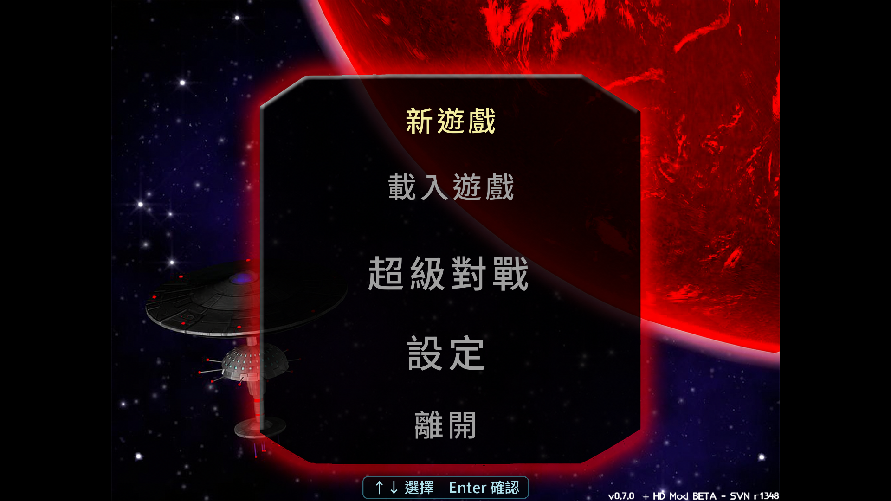
</p>

<p align="center"><em>1920×1080 全螢幕實機擷取；2560×1920 邏輯畫布平滑縮放至 1440×1080，左右保留黑邊。</em></p>

<p align="center">
  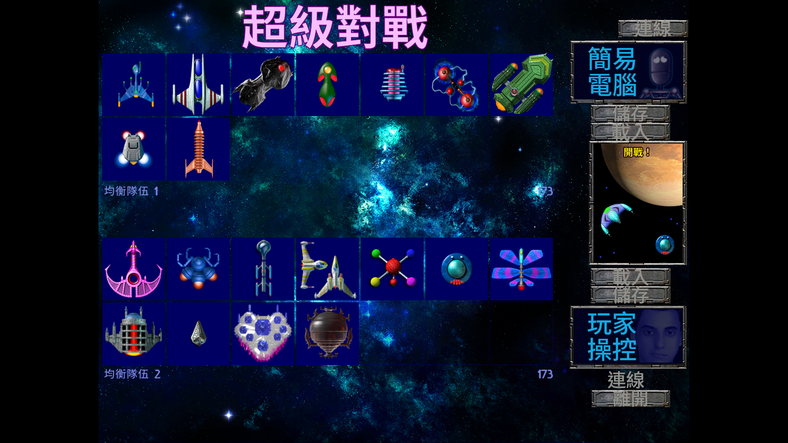
</p>

<p align="center"><em>原生 1080p 超級對戰實機畫面；標題與右側控制、儲存、載入、開戰及離開項目均為繁中。</em></p>

<p align="center">
  
</p>

<p align="center"><em>超級對戰實戰畫面；斯萊蘭卓與普坎克對戰，雙方 HUD 均顯示繁中的「船員／能量」。</em></p>

## 繁中資產來源與桌面版參考

本節記錄網頁版沿用的 v0.5.3 繁中套件、Windows 執行環境及資產重建來源；
網頁版的實際建置與部署請使用前述[從原始碼建置](#從原始碼建置)流程。

### 已建置套件

大型 `.uqm` 套件與 Windows 執行環境不放入 Git 歷史；請前往
[GitHub Releases](https://github.com/blhsing/uqm-hd-traditional-chinese/releases/latest)。
v0.5.3 壓縮檔包含單一自足的原生 1080p 繁中套件、管理式安裝器、驗證工具、
`runtime/windows-x86`（EXE、DLL、manifest 與授權文件），但**不包含原版遊戲的
`content`／音樂／語音／圖像**；安裝時仍須提供合法取得的 UQM-HD Beta 1 內容。

完整發行壓縮檔 `uqm-hd-zh-tw-v0.5.3.zip` 為 202,656,623 位元組，
SHA-256 為 `f4a17d3a7e40764060d8c7b7b06ef2f4bc411185d2f44126654adbda8c912870`。

本版本只需安裝一個套件；1x、2x 與 4x 繁中套件均已停止支援：

| 檔案 | 位元組 | SHA-256 |
|---|---:|---|
| `native1080-zh_TW.uqm` | 189,687,374 | `f24d1f55e326fe20bb577c53eb12836ecff71af7a8b34ea2520537ec4ef1aef2` |

發行包內的 Windows x86 執行環境由本儲存庫 `engine/` 的原始碼樹建置；
`runtime-manifest.json` 逐一鎖定所有 PE32/i386 payload、授權檔及完整 import graph，
未解析的非系統相依項為 0：

| 檔案 | 位元組 | SHA-256 |
|---|---:|---|
| `runtime/windows-x86/uqm-hd.exe` | 3,029,698 | `3532b966002ea9a2db127e0f8d352b63495f1adbc0591f15347c3cc1f3862530` |
| `runtime/windows-x86/runtime-manifest.json` | 27,388 | `1caa7174bc0eb5b8e396b9af45f0ccc1506f923ad58743e6011c512fa051dde1` |

安裝器另會安裝專用的多解析度 Windows 捷徑圖示，避免「開始」功能表依賴舊 SDL
執行檔內嵌資源而顯示空白文件圖示：

| 檔案 | 位元組 | SHA-256 |
|---|---:|---|
| `uqm-hd-zh-tw.ico` | 63,270 | `98333649d53f156d73afefe92c9582ad0ff32df8c84937e524aa1e1868f888ef` |

執行檔原先來自 commit `09a6fe4` 的乾淨 1,045 檔案桌面引擎樹。舊版官方 EXE 的四階段雜湊鎖定
PE 修補器仍保留作相容性備援；它會驗證完整輸入雜湊、唯一指令特徵、固定檔案位移及
PE checksum，遇到未知版本即拒絕修改。

### 自行重建繁中套件

需求：

- Python 3.10 以上；自行重建套件另需 `Pillow`。
- 從 [UQM-HD SourceForge 專案](https://sourceforge.net/projects/urquanmastershd/)取得並解壓縮的 Beta 1 `content` 目錄。
- `NotoSansTC-VF.ttf`；Windows 安裝 Noto Sans TC 後通常位於 `C:\Windows\Fonts`。

```powershell
python -m pip install -r .\tools\localization\requirements.txt

python .\tools\localization\uqm_localize.py validate `
  --workspace .\localization\workspace.zh-TW.final

python .\tools\localization\uqm_localize.py build `
  --content-root C:\path\to\UQM-HD\content `
  --workspace .\localization\workspace.zh-TW.final `
  --output .\localized-build `
  --font C:\Windows\Fonts\NotoSansTC-VF.ttf `
  --menu-background .\localization\menu-assets\source\newgame4x-clean-imagegen.png
```

如要從 `engine/` 重建及稽核 Windows PE32 執行環境，請依
[Windows x86 執行環境建置文件](docs/BUILD-WINDOWS.md)使用鎖定的可攜式 MSYS2
工具鏈；正式命令會拒絕 dirty 原始碼、套件版本漂移、未解析 DLL 或缺少授權文字。

### Windows 管理式安裝

先用 `-PlanOnly` 演練；確認輸入後再移除該參數正式安裝。推薦傳入發行包的
`runtime/windows-x86`：安裝器會驗證 manifest、每個 EXE／DLL 的大小與 SHA-256、
安裝路徑及授權來源，再把 `uqm-hd.exe` 安裝為受管理的 `uqm.exe`。這條路徑不需
Python，也不會對 EXE 套用二進位補丁。

```powershell
powershell.exe -NoProfile -ExecutionPolicy Bypass `
  -File .\tools\install\Install-UqmHdZhTw.ps1 `
  -SourceRoot C:\path\to\UQM-HD `
  -PacksDir .\packages `
  -RuntimeDir .\runtime\windows-x86 `
  -InstallRoot C:\Games\UQM-HD-TW `
  -ProfileDir "$env:APPDATA\UQM-HD-zh_TW" `
  -PlanOnly
```

使用自訂 runtime 時，`SourceRoot` 只需提供原版 `content` 與 `content\addons`；
來源根目錄的 EXE／DLL 不會複製進安裝。安裝器會建立隔離的設定／存檔目錄、
桌面與開始選單原生解析度全螢幕捷徑。更新時會移除舊版受管理的
1x／2x／4x 套件及捷徑；其他舊檔只會在其長度與 SHA-256 與上一次
安裝記錄仍完全相符時移除；使用者修改過的管理檔會令
安裝停止，無關檔案不會被鏡像刪除。進行中的交易使用獨立 `.installing` marker，
直到新安裝完整成功才取代上一份 complete marker。

### 推薦全螢幕模式

此主機的原生 1920×1080 範例：

```powershell
uqm.exe -o -r 1920x1080 -f -k -c bilinear --resfactor=3 `
  -C "$env:APPDATA\UQM-HD-zh_TW" --addon native1080-zh_TW
```

安裝器會自動把 `-r` 設為主螢幕原生解析度；`--resfactor=3` 會建立
2560×1920 的 4:3 邏輯畫布，`-c bilinear` 再由 GPU 平滑縮小至 1440×1080，
並在 1920×1080 螢幕左右保留黑邊，避免拉伸與像素化。必須保留
`--addon native1080-zh_TW`。遊戲中亦可按 `F11` 切換全螢幕。

## 完整玩法指南

### 遊戲目標

《The Ur-Quan Masters》結合太空探索、即時戰鬥、資源管理及外交劇情。你率領一艘以先驅者科技建造、可自由更換模組的旗艦返回太陽系，卻發現地球已被烏爾關封鎖，附近星際基地也瀕臨斷電。

低劇透的長期目標是恢復地球星際基地、探索銀河、蒐集資源與情報、尋找盟友，並建立足以挑戰烏爾關的艦隊。部分銀河事件會隨日期推進；不必倉促作戰，但也不要在超空間中毫無目的地消耗時間與燃料。

### 主選單

| 選項 | 功能 |
|---|---|
| **新遊戲** | 從故事開頭開始，設定艦長、旗艦及新聯盟名稱。 |
| **載入遊戲** | 從劇情模式存檔繼續。 |
| **超級對戰** | 編組兩支艦隊直接交戰，適合練習船艦。 |
| **設定** | 調整畫面、音訊、控制鍵及 PC／3DO 風格。 |
| **離開** | 結束遊戲。 |

### 預設鍵盤操作

所有按鍵均可在設定中檢視或更改。

| 類別 | 動作 | 預設按鍵 |
|---|---|---|
| 選單 | 移動 | 方向鍵或數字鍵盤 `8/2/4/6` |
| 選單 | 確認 | `Enter`、右 `Ctrl`、數字鍵盤 `Enter` |
| 選單 | 取消／指令選單 | `Space`、右 `Shift`、`Esc`、數字鍵盤 `0` |
| 系統 | 暫停 | `Pause` 或 `F1` |
| 系統 | 切換全螢幕 | `F11` |
| 系統（Windows 桌面版） | 擷取全螢幕至剪貼簿及 BMP | `PrtScr` |
| 航行／戰鬥 | 推進 | `↑` 或數字鍵盤 `8` |
| 航行／戰鬥 | 左／右轉 | `←`／`→` 或數字鍵盤 `4`／`6` |
| 戰鬥 | 主要武器 | 右 `Ctrl` 或 `Enter` |
| 戰鬥 | 特殊能力 | 右 `Shift`、右 `Alt` 或數字鍵盤 `0` |
| 劇情戰鬥 | 允許時緊急脫離 | `Esc` |
| 本機超級對戰 | 結束目前一局 | **只有 `Esc`** |

其他戰鬥配置包括 WASD（`W/S/A/D` 加 `V/B`）、Arrows (2)（方向鍵、`]`、`[`）及 ESDF（`E/D/S/F` 加 `Q/A`）。遊戲沒有通用倒車鍵；放開推進後仍保留慣性，必須轉向反推。蘇波克斯的平移是其專用特殊能力，不代表其他船艦可按向下鍵倒車。

#### 網頁版觸控操作

行動瀏覽器進入實際戰鬥後，網頁會自動顯示兩組半透明按鈕。玩家一使用左側組，
對應方向鍵、右 `Ctrl` 與右 `Shift`；玩家二使用右側組，對應預設 ESDF 配置。
按鈕支援多點觸控，所以可同時推進、轉向及開火。選單、艦隊格及船艦圖示則直接
觸碰目標，不需先移動虛擬游標。桌面瀏覽器不顯示觸控按鈕，完整保留原版鍵盤、
滑鼠及遊戲控制器操作。

#### 玩家二的超級對戰操作

本版本預設由玩家二控制超級對戰畫面**上方隊伍**，並使用 `ESDF` 控制配置。開始前先把上方控制框設為「玩家操控」；開戰後，兩位玩家各自使用自己的按鍵選船及控制船艦。

| 階段／動作 | 玩家二按鍵 |
|---|---|
| 選船：上／下／左／右 | `E`／`D`／`S`／`F` |
| 選船：確認 | `Q` |
| 戰鬥：推進 | `E` |
| 戰鬥：左轉／右轉 | `S`／`F` |
| 戰鬥：主要武器 | `Q` |
| 戰鬥：特殊能力 | `A` |

`D` 只在選船畫面用來向下移動；戰鬥中沒有通用倒車功能。繁中版本中，`Esc` 可結束目前一局並返回隊伍設定畫面。

若要更改按鍵，請從主選單進入「設定」→「設定控制鍵」：

1. 在「玩家二」選擇要使用的「控制配置」。
2. 若要修改配置本身，選擇「編輯控制鍵」。
3. 選定控制配置後，在「上／下／左／右／武器／特殊能力／離開」項目按 `Enter`，再按下新按鍵。
4. 按 `Delete` 可移除目前綁定；返回並離開設定選單後會儲存變更。

星圖常用鍵：

| 動作 | 按鍵 |
|---|---|
| 移動游標 | 方向鍵 |
| 設定自動導航 | `Enter` 或右 `Ctrl` |
| 縮放 | `Page Up`／`Page Down`、`+`／`-` |
| 搜尋恆星 | `F6` 或 `/` |
| 切換舊式星圖資料 | `F7` |
| 關閉星圖 | `Space`、右 `Shift` 或 `Esc` |

對話中可用 `↑/↓` 選回應、`Enter` 確認、`→` 快轉、`←` 重播；取消鍵可跳過目前語音或開啟對話摘要。座標、期限及種族名稱經常藏在對話裡，建議保留字幕並自行記錄。

登陸艇以 `↑` 前進、`←/→` 轉向、右 `Ctrl` 或 `Enter` 射擊；右 `Shift`、數字鍵盤 `0` 或 `Esc` 返回旗艦。登陸艇會自動拾取接觸到的物件；被摧毀時會失去登陸艇、艇員及尚未送回旗艦的貨物。

### 太陽系、超空間與星圖

在行星系內靠近行星或衛星即可進入近軌道；朝恆星系外緣航行會進入超空間。取消鍵會打開旗艦指令選單，常用項目包括掃描、星圖、裝置、貨艙、艦載清單、遊戲及導航。

超空間移動會持續消耗燃料。選取星圖上的恆星可設定自動導航並顯示預估需求；返回超空間後旗艦會自行前往，手動轉向或推進則取消導航。出發時要保留返航或繞道燃料。早期增加推進器及姿態噴射器，通常比立即把旗艦改成笨重砲臺更重要。

### 掃描、登陸與礦物

軌道資料會顯示溫度、天候、地殼活動、重力及大氣。高溫、高天候及高地殼活動會危及登陸艇；重力越高，派遣所需燃料越多。氣態巨行星及受到護盾保護的世界無法登陸。一次登陸最多消耗 3 單位燃料。

| 掃描 | 用途 |
|---|---|
| 礦物掃描 | 找出可帶回星際基地兌換資源單位的礦藏。 |
| 能量掃描 | 找出遺跡、裝置或任務相關訊號。 |
| 生物掃描 | 找出生命形態；通常需以登陸艇武器制伏後回收。 |

礦物每單位基礎價值：

| 類別 | 資源單位 | 類別 | 資源單位 |
|---|---:|---|---:|
| 常見 | 1 | 腐蝕性 | 2 |
| 卑金屬 | 3 | 稀有氣體 | 4 |
| 稀土 | 5 | 貴重 | 6 |
| 放射性 | 8 | 異質 | 25 |

危險世界上的少量普通礦物通常不值得冒險。早期優先處理低溫、低天候、低地殼活動且礦藏密集的行星；取得登陸艇防護後再回頭探索高風險世界。

### 資源單位、燃料、船員與旗艦模組

資源單位（RU）可購買燃料與船員、建造旗艦模組及護航艦。主要來源是礦物及戰後殘骸。此 HD 版本在基地購買一單位燃料的基礎成本是 20 資源單位；大量傷亡也會提高招募成本。

旗艦有 11 個推進器位置、8 個姿態噴射器位置及 16 個主要模組槽。

| 模組 | 功能 |
|---|---|
| 行星登陸艇 | 派員前往行星表面。 |
| 聚變推進器 | 提高速度與加速。 |
| 姿態噴射器 | 提高轉向速度。 |
| 船員艙 | 每座最多增加 50 名船員容量。 |
| 儲藏艙 | 每座增加 500 單位礦物容量。 |
| 燃料槽 | 每座增加 50 單位燃料容量。 |
| 發電機 | 加快戰鬥能量恢復。 |
| 離子脈衝砲 | 旗艦武器，射向依安裝槽位而定。 |

實用的早期順序是先裝約 5–6 具推進器、增加數具姿態噴射器、保留 1–2 座儲藏艙、攜帶足夠往返燃料，再逐步增加發電機、船員艙與武器。

### 戰鬥

`船員` 相當於船艦耐久度，降至零即被摧毀；`能量` 供武器及特殊能力使用。不要無腦按住射擊：很多船艦必須保留能量給護盾、變形、傳送或致命的一輪攻擊。

- 戰場邊緣彼此相連，飛出一側會從另一側出現。
- 行星重力可用於急轉或彈弓加速；撞上行星會受傷。
- 相剋關係往往比船艦費用更重要；飛彈、雷射、點防禦、速度與船員數各有優勢。
- 劇情中可先派護航艦消耗敵人；旗艦被摧毀的後果遠大於失去一般護航艦。
- 情勢不利時可嘗試 `Esc` 緊急脫離，但劇情條件不一定允許。

### 外交、情報與梅爾諾姆

遊戲沒有現代式完整任務追蹤器。線索來自外星種族對話、地球基地通報、能量掃描、星圖勢力範圍及取得的特殊裝置。第一次遇到陌生種族時先交談，記下恆星名稱、座標與期限；完成任務後返回地球基地詢問進度。

生物資料不在地球基地換成資源單位。梅爾諾姆商人會以信用點數收購生物資料，再出售燃料、情報及技術。登陸艇的防熱、防震、防雷、速度與容量等重要升級多由此取得。

### 儲存與新手路線

劇情模式有 50 個存檔欄位。建議輪替保留「安全返航、重大外交前、危險登陸前、遠航出發、目前進度」等多個存檔。此版本的獨立資料位於 `%APPDATA%\UQM-HD-zh_TW`；重新安裝前可備份整個目錄。

低劇透的新手流程：

1. 聽完太陽系星際基地的求救訊息。
2. 調查月球附近的情況。
3. 掃描水星並取得基地需要的放射性物質；取得足夠物資便離開危險表面。
4. 返回地球基地完成啟用流程。
5. 購買推進器、姿態噴射器、燃料及基本儲藏空間。
6. 探索太陽附近的安全恆星系，累積第一批資源單位。
7. 用超級對戰熟悉船艦，再開始更遠的外交與探索。
8. 收集生物資料，尋找梅爾諾姆升級登陸艇。
9. 每次遠航預留返航燃料，出發前另存一檔。

## 超級對戰

每隊最多 14 艘船；可載入、儲存隊伍並選擇人類或電腦控制。每艘船有不同費用，讓兩隊總值接近即可進行較公平的練習。

滑鼠可直接選擇右側按鈕、兩隊的 14 個欄位及 5×5 船艦清單；停在船艦上即可預覽船艦狀態。開戰前選船畫面另會顯示目前船艦的基本性能與能量資料。游標移動時顯示，按下鍵盤鍵或滑鼠鍵時隱藏，以免戰鬥中遮擋畫面。

編組時開啟 5×5「選擇船艦」面板、把游標移到任一船艦，再按左 `Alt`、右
`Alt` 或點擊 `船艦資料`，即可開啟該船艦的全螢幕資料頁；按 `Enter`／`Esc`，
或在資料頁可視範圍內任意位置按一下滑鼠左鍵，即可返回選船面板。點擊
`選擇船艦` 則與按 `Enter` 相同，會確認目前船艦。

在開戰前選船畫面按 `Esc`，會呼叫與紅色 `X` 相同的確認視窗；確認後回到隊伍設定。在**本機超級對戰**中按 `Esc` 會結束目前一局。這兩條路徑都只接受實體 `Escape`，所以右 `Shift`、右 `Alt` 與數字鍵盤 `0` 仍可正常發動玩家一的特殊能力。劇情模式的原版逃跑規則不變。

### 瀏覽器網路超級對戰

網頁版保留原版同步通訊協定，並把瀏覽器無法直接建立的 TCP 連線轉送至同站的
WebSocket 配對中繼。兩位玩家需使用相同版本，並約定一個 `10000` 至 `65535` 的
五位數房間連接埠；房間只容納兩條連線，任一方離線後即關閉。

1. 第一位玩家把玩家一設為「玩家操控」、玩家二設為「網路」；第二位玩家反向設定。
2. 兩邊都選「連線至遠端主機」，不要選「等候連入連線」。
3. 兩邊的「主機」都輸入 `127.0.0.1`，「連接埠」都輸入事先約定的同一個五位數房間碼。
4. 第一位進入者會等候第二位；顯示雙方已連線後即可編組及開戰。

所有遊戲封包都透過目前站台的 `wss://` 連線傳輸；中繼只依房間碼配對及逐幀轉送，
不改寫 UQM 封包。桌面端使用實體鍵盤或遊戲控制器，行動端使用網頁觸控按鈕操作遠端對戰；外層
「返回」按鈕仍可隨時送出 `Esc`，再按一次則退出遊戲回到啟動畫面。

## 船艦圖鑑

薩馬特拉（Sa-Matra）與烏爾關保安無人機（Ur-Quan Security Drone）不是可選船艦，因此不列入圖鑑。下表以單一、永遠展開的 HTML 表格收錄 25 艘超級對戰船艦。每艘船使用兩列：繁體中文及英文名稱位於第一欄並跨越兩列；其餘欄位依序列出船員、能量、費用、極速、加速、極速需時、自轉需時、能量恢復、武器耗能及特殊能力耗能。下一列以橫跨其餘 10 欄的儲存格呈現船艦圖片及說明；圖片靠左，武器、特殊能力與策略文字在右側自動換行。只有確實使用其他資源的特殊能力才會在特殊能力說明後另列資源規則。初始值與上限相同時只顯示一次；只有賽琳（Syreen）船員數及烏特維格（Utwig）能量值會分別列出初始值與上限。戰役專用的先驅者旗艦另於表格下方介紹。

表頭上標對應表後的單位及情境註釋。戰鬥邏輯以每秒 24 個戰鬥幀運作；加速及轉向時間依持續按鍵且不受重力、碰撞、後座力或敵方效果干擾的情況換算，實戰結果可能不同。變形、後燃器等能力造成的性能變化已在對應欄位標示；重力彈弓、武器後座力及特殊能力仍可能使實際速度超出一般極速。

<table width="100%">
<thead>
<tr>
<th>船艦名稱</th>
<th>船員<sup><a href="#user-content-vessel-note-1">1</a></sup></th>
<th>能量<sup><a href="#user-content-vessel-note-2">2</a></sup></th>
<th>費用<sup><a href="#user-content-vessel-note-3">3</a></sup></th>
<th>極速<sup><a href="#user-content-vessel-note-4">4</a></sup></th>
<th>加速<sup><a href="#user-content-vessel-note-5">5</a></sup></th>
<th>極速需時<sup><a href="#user-content-vessel-note-6">6</a></sup></th>
<th>自轉需時<sup><a href="#user-content-vessel-note-7">7</a></sup></th>
<th>能量恢復<sup><a href="#user-content-vessel-note-8">8</a></sup></th>
<th>武器耗能<sup><a href="#user-content-vessel-note-9">9</a></sup></th>
<th>特殊能力耗能<sup><a href="#user-content-vessel-note-10">10</a></sup></th>
</tr>
</thead>
<tbody>
<tr>
<td rowspan="2"><strong>安德羅辛斯・守護艦</strong><br><em>Androsynth Guardian</em></td>
<td>20</td>
<td>24</td>
<td>15</td>
<td><strong>一般：</strong>24<br><strong>Blazer 彗星形態：</strong>60</td>
<td>3</td>
<td>0.33</td>
<td><strong>一般形態：</strong>3.33<br><strong>Blazer 彗星形態：</strong>1.33</td>
<td>1（9）</td>
<td>3</td>
<td><strong>啟動：</strong>2<br><strong>維持：</strong>1（9）</td>
</tr>
<tr>
<td colspan="10"><strong>武器：</strong>耐久、長壽命的追蹤酸泡泡。<br><strong>特殊能力：</strong>變成高速 Blazer 彗星，以衝撞造成傷害；撞擊本身不扣自身生命，但並非對所有武器無敵。<br><strong>策略：</strong>先用泡泡封鎖空間，再變形追擊。爆發機動極強，但能量耗盡會強制復原，衝撞路線也較可預測。</td>
</tr>
<tr>
<td rowspan="2"><strong>阿里盧拉萊萊・小艇</strong><br><em>Ariloulaleelay Skiff</em></td>
<td>6</td>
<td>20</td>
<td>16</td>
<td>40</td>
<td>40</td>
<td>0.04</td>
<td>0.67</td>
<td>1（7）</td>
<td>2</td>
<td>3</td>
</tr>
<tr>
<td colspan="10"><strong>武器：</strong>近距離自動瞄準雷射。<br><strong>特殊能力：</strong>隨機瞬移。<br><strong>策略：</strong>無慣性、可立即改向，適合貼身繞背；只有 6 名船員且射程短，瞬移落點也不可控。</td>
</tr>
<tr>
<td rowspan="2"><strong>陳傑蘇・育巢艦</strong><br><em>Chenjesu Broodhome</em></td>
<td>36</td>
<td>30</td>
<td>28</td>
<td>27</td>
<td>0.6</td>
<td>1.88</td>
<td>4.67</td>
<td>1（5）</td>
<td>5</td>
<td>30</td>
</tr>
<tr>
<td colspan="10"><strong>武器：</strong>高傷害水晶；放開射擊鍵可手動炸成碎片。<br><strong>特殊能力：</strong>放出 DOGI 干擾衛星，撞擊時推開敵艦並抽走最多 10 能量。<br><strong>策略：</strong>重型區域控制艦，單發威力高但加速、轉向慢；DOGI 干擾衛星可被擊毀，召喚也需完整能量槽。</td>
</tr>
<tr>
<td rowspan="2"><strong>克姆爾混合種・化身艦</strong><br><em>Chmmr Avatar</em></td>
<td>42</td>
<td>42</td>
<td>30</td>
<td>35</td>
<td>1.17</td>
<td>1.25</td>
<td>2.67</td>
<td>1（2）</td>
<td>2</td>
<td>1</td>
</tr>
<tr>
<td colspan="10">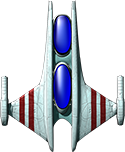<strong>武器：</strong>近距離連續雷射；三枚 ZapSat 護航衛星會自動攔截彈體並攻擊近敵。<br><strong>特殊能力：</strong>牽引光束。<br><strong>策略：</strong>把敵人拉入雷射及衛星殺傷圈。近戰壓制頂尖，但體型大、轉向慢，衛星被擊毀後防護會降低。</td>
</tr>
<tr>
<td rowspan="2"><strong>德魯吉・重擊艦</strong><br><em>Druuge Mauler</em></td>
<td>14</td>
<td>32</td>
<td>17</td>
<td>20</td>
<td>1</td>
<td>0.83</td>
<td>3.33</td>
<td>1（51）</td>
<td>4</td>
<td>—</td>
</tr>
<tr>
<td colspan="10">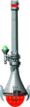<strong>武器：</strong>超長射程、造成 6 傷害且後座力極高的炮彈。<br><strong>特殊能力：</strong>犧牲 1 名船員換取 16 能量。<br><strong>資源規則：</strong>犧牲 1 名船員，回復 16 能量<br><strong>策略：</strong>利用炮擊後座力移動並遠距狙擊。火力優異，但自然能量恢復極慢，失誤會同時消耗能量與船員。</td>
</tr>
<tr>
<td rowspan="2"><strong>地球人・巡洋艦</strong><br><em>Earthling Cruiser</em></td>
<td>18</td>
<td>18</td>
<td>11</td>
<td>24</td>
<td>0.6</td>
<td>1.67</td>
<td>1.33</td>
<td>1（9）</td>
<td>9</td>
<td>4</td>
</tr>
<tr>
<td colspan="10"><strong>武器：</strong>長距離追蹤核彈。<br><strong>特殊能力：</strong>近距離點防禦雷射。<br><strong>策略：</strong>遠距離發射核彈並攔截威脅；便宜、容易上手，但核彈可被擊落，近戰及能量恢復較弱。</td>
</tr>
<tr>
<td rowspan="2"><strong>伊爾拉斯・復仇艦</strong><br><em>Ilwrath Avenger</em></td>
<td>22</td>
<td>16</td>
<td>10</td>
<td>25</td>
<td>5</td>
<td>0.21</td>
<td>2.00</td>
<td>4（5）</td>
<td>1</td>
<td>3</td>
</tr>
<tr>
<td colspan="10"><strong>武器：</strong>船首短距離火焰。<br><strong>特殊能力：</strong>隱形；隱形中開火會解除隱形並自動朝向敵艦。<br><strong>策略：</strong>隱形接近後貼身噴火，近距離輸出高；缺乏遠程手段，對手仍可從畫面與聲音推測位置。</td>
</tr>
<tr>
<td rowspan="2"><strong>克爾阿・掠奪艦</strong><br><em>Kohr-Ah Marauder</em></td>
<td>42</td>
<td>42</td>
<td>30</td>
<td>30</td>
<td>0.86</td>
<td>1.46</td>
<td>3.33</td>
<td>1（5）</td>
<td>6</td>
<td>21</td>
</tr>
<tr>
<td colspan="10"><strong>武器：</strong>最多部署 8 枚耐久旋鋸；放開射擊後減速，接近敵艦時重新追蹤。<br><strong>特殊能力：</strong>向 16 個方向爆出火焰氣雲。<br><strong>策略：</strong>擅長布置雷區與近身清場；船體笨重，環形爆發會消耗一半能量。</td>
</tr>
<tr>
<td rowspan="2"><strong>梅爾諾姆・商旅艦</strong><br><em>Melnorme Trader</em></td>
<td>20</td>
<td>42</td>
<td>18</td>
<td>36</td>
<td>1.2</td>
<td>1.25</td>
<td>3.33</td>
<td>1（5）</td>
<td>5</td>
<td>20</td>
</tr>
<tr>
<td colspan="10">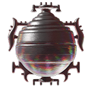<strong>武器：</strong>可蓄力四級的能量彈；四級傷害依序為 2、4、8、16。<br><strong>特殊能力：</strong>混亂射線迫使敵艦轉向並暫時封鎖特殊動作。<br><strong>策略：</strong>先以混亂射線控制，再用滿蓄力彈收尾；蓄力需要時間，射線亦會消耗 20 能量。</td>
</tr>
<tr>
<td rowspan="2"><strong>姆爾恩姆赫姆・變形艦</strong><br><em>Mmrnmhrm X-Form</em></td>
<td>20</td>
<td>10</td>
<td>19</td>
<td><strong>飛碟形態：</strong>20<br><strong>火箭形態：</strong>50</td>
<td><strong>飛碟形態：</strong>2.5<br><strong>火箭形態：</strong>10</td>
<td><strong>飛碟形態：</strong>0.33<br><strong>火箭形態：</strong>0.21</td>
<td><strong>飛碟形態：</strong>2.00<br><strong>火箭形態：</strong>10.00</td>
<td><strong>飛碟形態：</strong>2（7）<br><strong>火箭形態：</strong>1（7）</td>
<td>1</td>
<td>10</td>
</tr>
<tr>
<td colspan="10">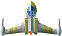<strong>武器：</strong>飛碟形態使用雙雷射；火箭形態使用追蹤飛彈。<br><strong>特殊能力：</strong>在飛碟與高速火箭形態之間切換。<br><strong>策略：</strong>依對手在靈活近戰及高速遠攻之間切換；變形需要完整能量，兩種形態各有明顯短板。</td>
</tr>
<tr>
<td rowspan="2"><strong>邁康・孢子艦</strong><br><em>Mycon Podship</em></td>
<td>20</td>
<td>40</td>
<td>21</td>
<td>27</td>
<td>1.29</td>
<td>0.88</td>
<td>4.67</td>
<td>1（5）</td>
<td>20</td>
<td>40</td>
</tr>
<tr>
<td colspan="10"><strong>武器：</strong>追蹤等離子體，威力隨飛行時間衰減。<br><strong>特殊能力：</strong>耗盡 40 能量，恢復最多 4 名船員。<br><strong>策略：</strong>適合遠距消耗及長局續戰；船體遲鈍，等離子體可被攔截且遠距命中時傷害較低。</td>
</tr>
<tr>
<td rowspan="2"><strong>奧茲・復仇女神艦</strong><br><em>Orz Nemesis</em></td>
<td>16</td>
<td>20</td>
<td>23</td>
<td>35</td>
<td>5</td>
<td>0.29</td>
<td>1.33</td>
<td>1（7）</td>
<td>6</td>
<td>0</td>
</tr>
<tr>
<td colspan="10"><strong>武器：</strong>可獨立旋轉的炮塔；按住特殊能力鍵再按左右方向鍵可轉動炮塔。<br><strong>特殊能力：</strong>按住特殊能力鍵再按射擊鍵可派出太空陸戰隊；每隊暫時占用 1 名船員。<br><strong>資源規則：</strong><strong>太空陸戰隊：</strong>每隊暫時占用 1 名本艦船員<br><strong>策略：</strong>可一邊航行一邊向不同方向射擊，陸戰隊直接削減敵船員；過度部署會掏空本艦船員。</td>
</tr>
<tr>
<td rowspan="2"><strong>普坎克・狂怒艦</strong><br><em>Pkunk Fury</em></td>
<td>8</td>
<td>12</td>
<td>20</td>
<td>64</td>
<td>16</td>
<td>0.17</td>
<td>0.67</td>
<td>0</td>
<td>1</td>
<td>−2</td>
</tr>
<tr>
<td colspan="10"><strong>武器：</strong>同時向前、左、右三向射擊。<br><strong>特殊能力：</strong>辱罵可回復 2 能量；被摧毀時有 50% 機率以滿狀態復活。<br><strong>策略：</strong>速度與轉向極佳，容易繞側面；船員少、單發傷害低，復活完全依賴機率。</td>
</tr>
<tr>
<td rowspan="2"><strong>索菲克斯提・偵察艦</strong><br><em>Shofixti Scout</em></td>
<td>6</td>
<td>4</td>
<td>5</td>
<td>35</td>
<td>5</td>
<td>0.29</td>
<td>1.33</td>
<td>1（10）</td>
<td>1</td>
<td>0</td>
</tr>
<tr>
<td colspan="10"><strong>武器：</strong>威力較弱的正面炮。<br><strong>特殊能力：</strong>連續觸發可啟動 Glory Device（榮光自爆裝置），對近敵造成巨量傷害。<br><strong>策略：</strong>低費用交換型船艦，常用來重創昂貴大船；常規戰力弱，自爆成功仍會失去本艦。</td>
</tr>
<tr>
<td rowspan="2"><strong>斯萊蘭卓・探測器</strong><br><em>Slylandro Probe</em></td>
<td>12</td>
<td>20</td>
<td>17</td>
<td><strong>固定：</strong>60</td>
<td>不適用</td>
<td>不適用</td>
<td>0.67</td>
<td>0</td>
<td>2</td>
<td>0</td>
</tr>
<tr>
<td colspan="10">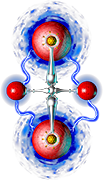<strong>武器：</strong>近距離追蹤閃電。<br><strong>特殊能力：</strong>吸收附近完整小行星以補滿能量，但不能吸收有限壽命的戰鬥碎屑；推進鍵會立即反轉 180 度。<br><strong>資源規則：</strong><strong>小行星充能：</strong>吸收完整小行星後補滿能量<br><strong>策略：</strong>永遠以最高速移動且免疫賽琳類船員移除效果，但仍會受一般傷害。沒有被動能量恢復，也不能停船。</td>
</tr>
<tr>
<td rowspan="2"><strong>斯帕西・逃逸艦</strong><br><em>Spathi Eluder</em></td>
<td>30</td>
<td>10</td>
<td>18</td>
<td>48</td>
<td>6</td>
<td>0.33</td>
<td>1.33</td>
<td>1（11）</td>
<td>2</td>
<td>3</td>
</tr>
<tr>
<td colspan="10">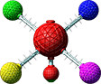<strong>武器：</strong>船首弱彈。<br><strong>特殊能力：</strong>從船尾發射追蹤 B.U.T.T. 飛彈。<br><strong>策略：</strong>一面逃跑一面從後方射擊；速度快、船員多，但傷害較低，必須控制敵人位於船尾。</td>
</tr>
<tr>
<td rowspan="2"><strong>蘇波克斯・刀鋒艦</strong><br><em>Supox Blade</em></td>
<td>12</td>
<td>16</td>
<td>16</td>
<td>40</td>
<td>8</td>
<td>0.21</td>
<td>1.33</td>
<td>1（5）</td>
<td>1</td>
<td>0</td>
</tr>
<tr>
<td colspan="10"><strong>武器：</strong>快速正面彈。<br><strong>特殊能力：</strong>按住特殊能力鍵再按向上可後退；配合向左或向右可側移；同時按三鍵可後斜移，艦首方向不變。<br><strong>策略：</strong>保持瞄準同時閃避，操作上限高；船員少、常規射擊威力低，控制負擔較大。</td>
</tr>
<tr>
<td rowspan="2"><strong>賽琳・穿透艦</strong><br><em>Syreen Penetrator</em></td>
<td><strong>初始：</strong>12<br><strong>上限：</strong>42</td>
<td>16</td>
<td>13</td>
<td>36</td>
<td>4.5</td>
<td>0.33</td>
<td>1.33</td>
<td>1（7）</td>
<td>1</td>
<td>5</td>
</tr>
<tr>
<td colspan="10"><strong>武器：</strong>正面炮。<br><strong>特殊能力：</strong>歌聲使範圍內敵艦船員飄出太空；碰觸漂浮船員可收編，最多可增至 42 人。<br><strong>策略：</strong>初始只有 12 人，但貼近高船員目標可迅速反轉兵力差；接近過程危險，對無船員目標效果差。</td>
</tr>
<tr>
<td rowspan="2"><strong>瑟拉達什・火炬艦</strong><br><em>Thraddash Torch</em></td>
<td>8</td>
<td>24</td>
<td>10</td>
<td><strong>一般：</strong>28<br><strong>後燃器：</strong>72</td>
<td><strong>一般：</strong>7<br><strong>後燃器：</strong>12</td>
<td><strong>一般：</strong>0.17<br><strong>後燃器：</strong>隨脈衝動態變化</td>
<td>1.33</td>
<td>1（7）</td>
<td>2</td>
<td>1</td>
</tr>
<tr>
<td colspan="10">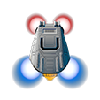<strong>武器：</strong>威力較低的常規炮。<br><strong>特殊能力：</strong>後燃器提供極高速並留下可傷敵的火焰軌跡。<br><strong>策略：</strong>以爆發速度突襲、脫離或引誘追兵撞進火焰；船員少，成果高度依賴路線與能量管理。</td>
</tr>
<tr>
<td rowspan="2"><strong>烏姆加・無人機</strong><br><em>Umgah Drone</em></td>
<td>10</td>
<td>30</td>
<td>7</td>
<td>18</td>
<td>1.5</td>
<td>0.50</td>
<td>3.33</td>
<td>30（151）</td>
<td>0</td>
<td>1</td>
</tr>
<tr>
<td colspan="10"><strong>武器：</strong>船首連續反物質錐，可摧毀近距離彈體。<br><strong>特殊能力：</strong>朝後方高速衝刺。<br><strong>策略：</strong>倒衝瞬間貼近或逃離，再以錐形武器磨碎敵人；射程極短、轉向慢，操作不直覺。</td>
</tr>
<tr>
<td rowspan="2"><strong>烏爾關・無畏艦</strong><br><em>Ur-Quan Dreadnought</em></td>
<td>42</td>
<td>42</td>
<td>30</td>
<td>30</td>
<td>0.86</td>
<td>1.46</td>
<td>3.33</td>
<td>1（5）</td>
<td>6</td>
<td>8</td>
</tr>
<tr>
<td colspan="10"><strong>武器：</strong>正面重型融合彈。<br><strong>特殊能力：</strong>每次啟動最多派出兩架戰鬥機，每架暫時占用 1 名船員；返艦後歸隊，被毀則永久損失。<br><strong>資源規則：</strong>最多派出兩架戰鬥機；每架暫時占用 1 名船員<br><strong>策略：</strong>耐久、火力及持續騷擾俱佳；體型與轉向是主要弱點，戰鬥機也可能造成實質船員損失。</td>
</tr>
<tr>
<td rowspan="2"><strong>烏特維格・巨獸艦</strong><br><em>Utwig Jugger</em></td>
<td>20</td>
<td><strong>初始：</strong>10<br><strong>上限：</strong>20</td>
<td>22</td>
<td>36</td>
<td>0.86</td>
<td>1.75</td>
<td>1.33</td>
<td>0</td>
<td>0</td>
<td>1</td>
</tr>
<tr>
<td colspan="10">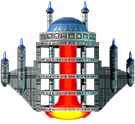<strong>武器：</strong>免費的多管正面齊射。<br><strong>特殊能力：</strong>護盾消耗能量，但把吸收的武器傷害轉成能量。<br><strong>策略：</strong>可反制高傷害彈體；沒有自然能量恢復，過早或空按護盾會耗乾電池，部分特殊攻擊也能繞過優勢。</td>
</tr>
<tr>
<td rowspan="2"><strong>VUX・入侵艦</strong><br><em>VUX Intruder</em></td>
<td>20</td>
<td>40</td>
<td>12</td>
<td>21</td>
<td>1.4</td>
<td>0.63</td>
<td>4.67</td>
<td>1（9）</td>
<td>1</td>
<td>2</td>
</tr>
<tr>
<td colspan="10">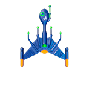<strong>武器：</strong>近距離連續雷射。<br><strong>特殊能力：</strong>追蹤寄生體命中後會永久降低敵艦極速、加速與轉向；開戰時常躍遷到接近敵艦的位置。<br><strong>策略：</strong>初始位置有利時可立即壓制；寄生體可拖垮對手，但本艦極慢，突擊失敗後容易被風箏。</td>
</tr>
<tr>
<td rowspan="2"><strong>耶哈特・終結艦</strong><br><em>Yehat Terminator</em></td>
<td>20</td>
<td>10</td>
<td>23</td>
<td>30</td>
<td>2</td>
<td>0.63</td>
<td>2.00</td>
<td>2（7）</td>
<td>1</td>
<td>3</td>
</tr>
<tr>
<td colspan="10"><strong>武器：</strong>快速雙炮。<br><strong>特殊能力：</strong>短暫全向護盾。<br><strong>策略：</strong>加速與轉向良好，可在護盾間隙換血；能量槽小，連續誤開會迅速失去防禦。</td>
</tr>
<tr>
<td rowspan="2"><strong>佐克－福特－皮克・毒刺艦</strong><br><em>Zoq-Fot-Pik Stinger</em></td>
<td>10</td>
<td>10</td>
<td>6</td>
<td>40</td>
<td>10</td>
<td>0.17</td>
<td>1.33</td>
<td>1（5）</td>
<td>1</td>
<td>7</td>
</tr>
<tr>
<td colspan="10">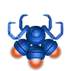<strong>武器：</strong>威力較弱的正面彈。<br><strong>特殊能力：</strong>極短距離舌擊，消耗 7 能量並造成 12 傷害。<br><strong>策略：</strong>低費用伏擊艦，貼身舌擊能意外擊殺昂貴目標；船員少，舌擊距離非常短。</td>
</tr>
</tbody>
</table>

<p><span id="vessel-note-1"><sup>1</sup></span> 船員人數；只有初始值與上限不同時才分列。<br><span id="vessel-note-2"><sup>2</sup></span> 能量單位；只有初始值與上限不同時才分列。<br><span id="vessel-note-3"><sup>3</sup></span> 超級對戰編隊點數。<br><span id="vessel-note-4"><sup>4</sup></span> 引擎內部速度單位。<br><span id="vessel-note-5"><sup>5</sup></span> 每 1 個戰鬥幀增加的速度單位；非整數四捨五入至小數點後兩位。<br><span id="vessel-note-6"><sup>6</sup></span> 由靜止加速至極速所需秒數。<br><span id="vessel-note-7"><sup>7</sup></span> 完成 360 度自轉所需秒數。<br><span id="vessel-note-8"><sup>8</sup></span> 每一回復週期增加的能量；括號內為週期所需戰鬥幀，0 表示沒有自然恢復。<br><span id="vessel-note-9"><sup>9</sup></span> 每次發射主武器消耗的能量。<br><span id="vessel-note-10"><sup>10</sup></span> 每次使用特殊能力消耗的能量；負數表示回復，括號內為持續消耗週期所需戰鬥幀，— 表示不以能量驅動。</p>

### 先驅者旗艦（戰役專用） / Precursor Flagship

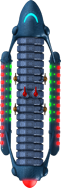

先驅者旗艦不屬於超級對戰的 25 艘可選船艦，僅在戰役中使用；遊戲內名稱由玩家自行命名。它的性能取決於安裝模組，因此不適合與固定規格的超級對戰船艦共列比較。

- **船員數：** 每個船員艙提供 50 名容量，另計艦長 1 名；目前船員數取決於已招募人數，上限取決於已安裝的船員艙。
- **能量值：** 42。
- **超級對戰編隊費用：** 不適用。
- **極速：** 取決於 11 個推進器位置中已安裝的聚變推進器。
- **推進／加速度：** 取決於已安裝的聚變推進器。
- **加速至極速：** 沒有單一固定時間。
- **完成 360 度轉向：** 取決於 8 個姿態噴射器位置中已安裝的噴射器。
- **自然能量恢復：** 取決於 16 個主要模組槽中的發電機種類與數量。
- **主武器能量消耗：** 取決於武器模組及追蹤系統配置。
- **特殊能力能量消耗：** 取決於已安裝的點防禦模組數量；未安裝時無法使用。
- **燃料容量：** 取決於已安裝的燃料槽。
- **貨艙容量：** 取決於已安裝的儲藏艙。

**武器：** 可安裝離子脈衝砲等武器模組；砲組射向由安裝槽位決定。

**特殊能力：** 取得技術並安裝點防禦模組後，特殊能力鍵可啟動防禦雷射；未安裝時沒有這項能力。

**策略：** 高度自訂，後期火力與續航可達極高水準；初期則遲鈍，各類模組會競爭有限槽位，而且旗艦被摧毀通常代表戰役結束。

## 測試與驗證

```powershell
npx tsc --noEmit
npm run build
npm run build:azure
```

WebAssembly 建置後，驗證器會檢查 HTML、JavaScript、WASM、資料封包及五個
外部載入內容檔；Azure 回應另須具備 `application/wasm` MIME、COOP、COEP 與
CORP 標頭，確保 pthread 可正常執行。下列桌面版測試則保留作為繁中資產及
原始引擎修改的回歸依據：

```powershell
python -m unittest discover -s .\tools\localization\tests -v

powershell.exe -NoProfile -ExecutionPolicy Bypass `
  -File .\tools\install\Test-UqmHdZhTwInstall.ps1 `
  -InstallRoot C:\Games\UQM-HD-TW `
  -ProfileDir "$env:APPDATA\UQM-HD-zh_TW" `
  -PacksDir .\localized-build\packages `
  -SmokeTimeoutSeconds 12
```

v0.5.3 本機驗收涵蓋 67 項 Python 回歸測試及 Windows PowerShell 5.1 驗證器，包括
管理檔案的長度及 SHA-256、單一自足原生 1080p UQM 套件、兩個全螢幕捷徑、
自訂 runtime manifest、未列入 manifest 的 EXE／DLL、玩家一右 `Alt` 綁定，以及
12 秒 1920×1080 超取樣全螢幕煙霧測試。實機超級對戰流程另確認繁中隊伍設定、
較輕的 `船員／能量` 狀態字、船艦資料卡、`Esc` 返回確認及右 `Alt` 特殊能力；
選船／資料按鈕與資料頁滑鼠返回另由來源與資產回歸測試覆蓋。本版也在實際戰鬥中
確認雙方船艦正常顯示，並由日誌核對安全的 `17408 × 15360` 戰鬥轉場範圍；
Windows Shell 另確認「開始」功能表捷徑可解析為非空白的 32×32 圖示。
完整發行紀錄見 [v0.5.3 發行說明](docs/releases/v0.5.3.md)。

## 專案結構

| 路徑 | 內容 |
|---|---|
| `app/` | 雙語網頁啟動器、下載進度、返回行為、桌面原版控制及行動端雙玩家觸控戰鬥介面。 |
| `engine/` | UQM-HD Beta 1 程式原始碼、既有繁中修改，以及 Emscripten、IDBFS 與瀏覽器輸入橋接。 |
| `engine/wasm/` | WebAssembly 預載、遠端高解析度內容載入、全螢幕畫布及瀏覽器存檔程式。 |
| `localization/workspace.zh-TW.final/` | 受格式契約保護的完整 LLM 繁中翻譯。 |
| `localization/records.*.json` | 英文來源與 LLM 翻譯的平面記錄。 |
| `tools/localization/` | 匯出、合併、換行、驗證、點陣字型及套件建置工具。 |
| `scripts/stage-content.ps1` | 驗證並暫存使用者提供的原版內容及既有繁中資產。 |
| `scripts/build-web-engine.ps1` | 以 Emscripten 建置引擎並產生可發布的瀏覽器檔案。 |
| `scripts/deploy-azure.ps1` | 在既有 Standard S1 App Service 註冊及更新 `/starcontrol2`。 |
| `server/netplay-server.cjs` | 將兩條同房間 WebSocket 配對並逐幀轉送原版網路超級對戰資料。 |

## 已知限制

- `SCRAP`、`QuasiSpace` 等少數執行檔硬編碼文字仍為英文。
- 英文原聲沒有重新配音；繁中以字幕呈現。
- LLM 初譯尚未完成逐句母語人工校訂及完整劇情通關。
- 繁中版本只提供原生 1080p 超取樣資產；1x、2x 與 4x 模式不再支援。
- 高解析度圖像、英文語音與音樂合計約 716 MiB；首次啟動需要較長下載時間，
  並需要足夠的 Cache Storage 配額。成功快取後不會在每次啟動時重新下載。
- Safari 及行動瀏覽器可能依裝置記憶體限制重新載入大型遊戲分頁。

## 授權與致謝

- UQM 程式碼：GPL-2.0-or-later。
- 遊戲內容、翻譯、船艦圖片及衍生選單圖像：CC BY-NC-SA 2.5。
- 文件：CC BY 2.0。
- Noto Sans TC：SIL Open Font License 1.1；本 Git 歷史不包含字型檔，但建置輸出使用該字型產生字形。
- 瀏覽器網路中繼的 `ws` 套件：MIT License。
- 其他第三方元件依各自授權；完整文本及歸屬位於 `LICENSES/`、`engine/COPYING` 與來源檔案。

原作 © 1992、1993 Toys for Bob, Inc.；UQM 與 UQM-HD 的程式、內容及移植貢獻歸各自作者所有。本專案不受 Toys for Bob、Pistol Shrimp、SourceForge 或原發行商背書。

繁體中文翻譯與工具整合由本專案維護者使用 OpenAI Codex 完成。船艦圖像取自 UQM-HD `hires4x.zip`，依 CC BY-NC-SA 2.5 使用並保持相同方式分享。
