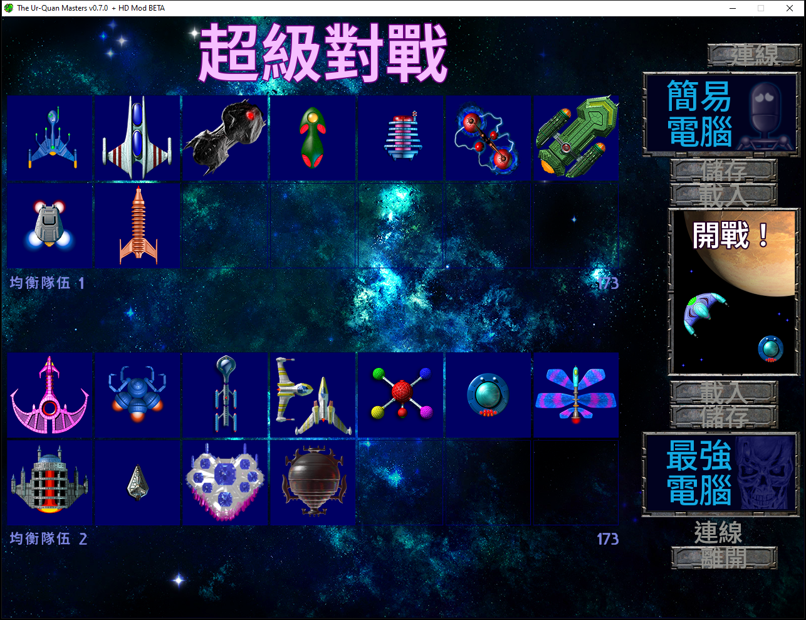

# v0.3.0 — 可重現的繁中自訂執行環境、Super Melee 操作改善

此版本將 OpenAI Codex 語言模型重新完成的繁體中文翻譯、可讀性修正、
Super Melee 操作改善，以及由公開原始碼重建的 Windows x86 執行環境整合成
同一套可驗證發行物。翻譯涵蓋 107 份資源中的 5,177 筆可翻譯記錄；目前仍未
經完整母語人工逐句校訂及全流程通關。

發行 ZIP **不含 UQM-HD 原版的受著作權保護遊戲內容**。安裝時仍須由使用者
自己的 UQM-HD Beta 1 安裝目錄提供 `content` 與其內的 `content/addons` 原版資料；本版本不會
把這些內容重新散布到 Git 倉庫或 GitHub Release。

## 本版重點

- 主選單完整本地化為「新遊戲、載入遊戲、超級對戰、設定、離開」；
  Super Melee 的標題、玩家／電腦控制、難度、網路、儲存、載入、開戰及離開
  介面亦已本地化。
- 選取中的選單項目使用醒目的黃色脈衝，不再沿用難以和未選取項目區分的暗紅色。
- 以 Noto Sans TC 重建 1x／2x／4x 點陣字型，並依用途調整字重與光學尺寸。
  主遊戲的太陽、月份、日期、船長、船名、燃料及船員等固定高度欄位不再裁切
  中文字形；Super Melee 的「船員／能量」（CREW／BATT）也改用較清楚的輕字重。
- 修正開始新遊戲後停在黑畫面的資源封裝問題；推薦使用 4x 資源、最近鄰縮放
  與全螢幕模式，1920×1080 的已驗證啟動組合已寫入捷徑及 README。
- 主選單、Super Melee 隊伍設定、船艦編組與開戰前選船支援滑鼠。游標停在船艦
  上會同步更新資料；移動滑鼠會顯示游標，按鍵或按下滑鼠鍵會隱藏游標。
- Super Melee 的 5×5 船艦選擇與開戰前選船畫面共用詳細資料卡，顯示船員、
  能量、費用、極速、加速、轉向、回能、武器消耗及特殊能力消耗。
- 本機 Super Melee 戰鬥中按 `Esc` 可結束目前一局並返回隊伍設定；開戰前選船
  畫面按 `Esc` 與紅色 `X` 會進入相同的離開確認流程。
- 玩家一的特殊能力除了右 `Shift` 與數字鍵盤 `0`，亦可使用右 `Alt`；原有按鍵
  維持不變。
- README 明確列出玩家二的選船及戰鬥操作：預設以上方隊伍搭配 ESDF 配置，
  `E` 推進、`S/F` 轉向、`Q` 主武器、`A` 特殊能力。
- README 中 25 艘船艦的說明全部直接展開，不再藏在摺疊項目；每艘均有船員、
  能量、費用、極速、加速、轉向、回能與消耗表，並保留船艦圖片及更新後的
  Super Melee 示範截圖。

<p align="center">
  
</p>

<p align="center">
  
</p>

<p align="center">
  
</p>

## 發行檔案

下載 `uqm-hd-zh-tw-v0.3.0.zip` 並完整解壓縮。壓縮檔包含三個必須一起安裝的
繁中套件、管理式安裝與驗證工具，以及可稽核的自訂 Windows x86 執行環境；
請依 `INSTALL.zh-TW.txt` 操作。

| 檔案 | 位元組 | SHA-256 |
|---|---:|---|
| `zh_TW.uqm` | 21,220,000 | `700a93776b724eddd145537eb3eb954eb5fd61b6d6926b22ed2b241e4a17ed06` |
| `hires2x-zh_TW.uqm` | 40,444,272 | `6d004566201ea8aaee3a9a82c2eeab61e02f30bd95e5cede7d19722050e199b0` |
| `hires4x-zh_TW.uqm` | 60,658,122 | `7e63136a803dfbc57fe3e56360b242911d4d891fd6b4ad4b40e8d540cc1a3116` |

自訂執行環境的核心檔案：

| 檔案 | 位元組 | SHA-256 |
|---|---:|---|
| `runtime/windows-x86/uqm-hd.exe` | 3,020,273 | `2ef0f8ca00baad2f9c5611f8885a34acb54f16bc5c7fecb29ee7d6632d3be018` |
| `runtime/windows-x86/runtime-manifest.json` | 51,276 | `3facebf59aafb4a373cf55bfc59953b9d4d4fcfe4c6feac96674e316123c9220` |

完整發行 ZIP 為 135,241,492 bytes，SHA-256：

```text
86a4788adc69a03cd5ca8705a11292386cfdcd8119bee45b1b6db1640df74dae
```

## 原始碼與執行環境來源

Windows x86 執行環境由乾淨的 Git 提交
`1aee01896e88f759271779efcc03f58508c52f7f` 重建。建置清單記錄 1,043 個
乾淨原始碼檔案及其整體指紋；執行檔與所有相依 DLL 均由鎖定的 MSYS2
MINGW32 套件與倉庫內建置配方產生。

`runtime-manifest.json` 鎖定 20 個 PE32 payload（1 個執行檔與 19 個 DLL）
的長度、SHA-256、套件版本、來源及授權。相依匯入閉包檢查結果為 0 個未解析
的非系統匯入；發行環境另附 27 份對應授權文件。完整重建方式請參閱
`docs/BUILD-WINDOWS.md`。

## 驗證結果

- 本地化、資源契約、滑鼠／選船邏輯、執行環境與發行封裝共 48 項自動測試，
  全部通過。
- 最終管理式安裝包含 11,534 個受管理檔案；安裝後 17 項完整性與設定檢查
  全部通過。
- 以 4x、1920×1080 全螢幕設定完成 12 秒啟動煙霧測試。
- 實機確認繁中主選單及 Super Melee、黃色選取色、開戰前船艦資料卡、
  `Esc` 返回流程，以及玩家一右 `Alt` 特殊能力輸入。

英文原聲沒有重新配音；翻譯尚未完成逐句母語人工校訂及完整劇情通關；
網路 Super Melee 尚未驗證。遊戲內容、翻譯及衍生圖像採 CC BY-NC-SA 2.5，
**不得作商業用途**；其他程式、文件、字型及第三方函式庫的授權請參閱
倉庫的 `LICENSE`、`NOTICE.md` 與發行物中的 `LICENSES/`。
